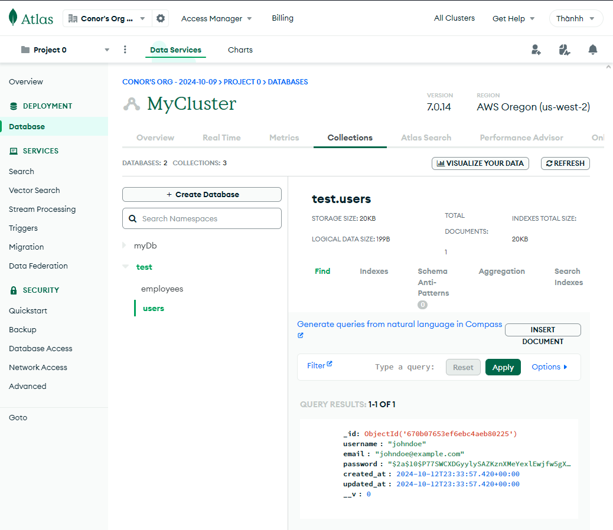
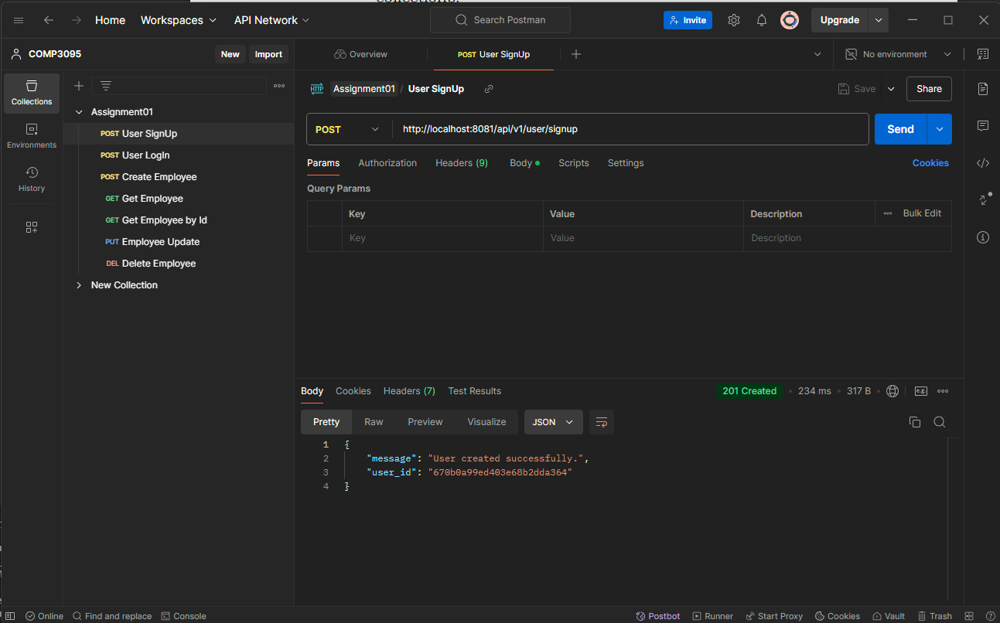
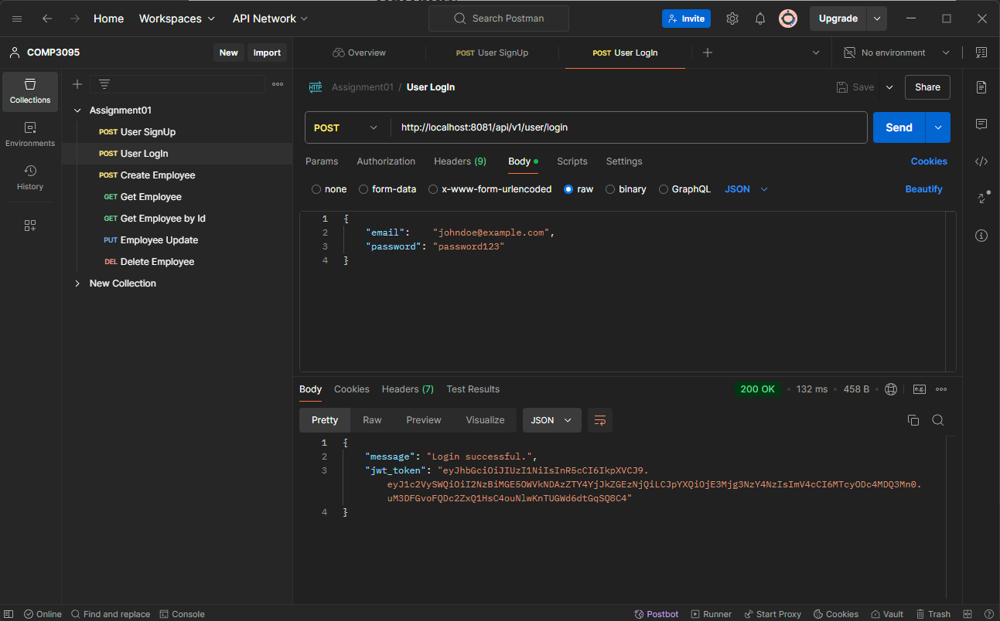
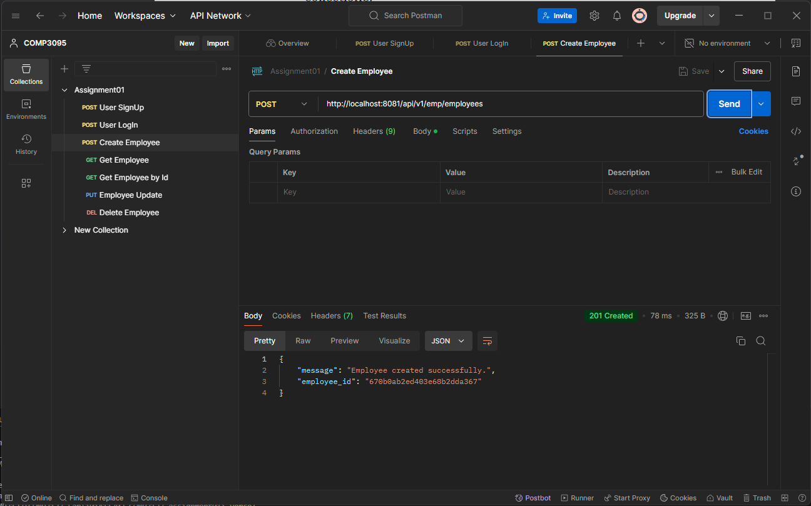
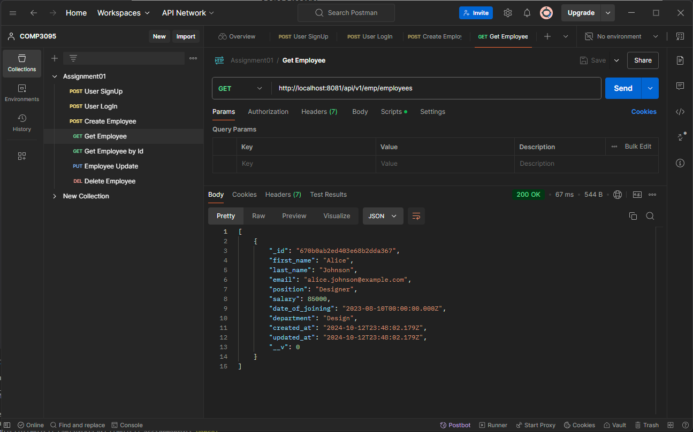
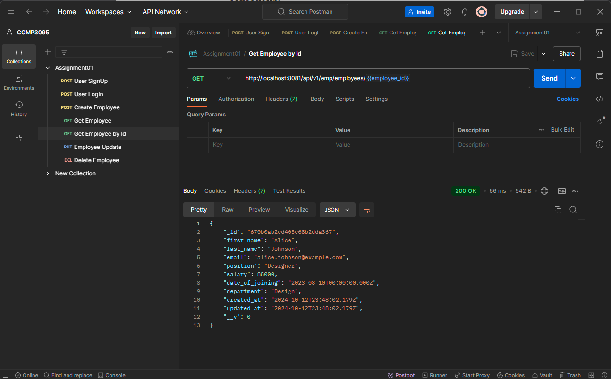
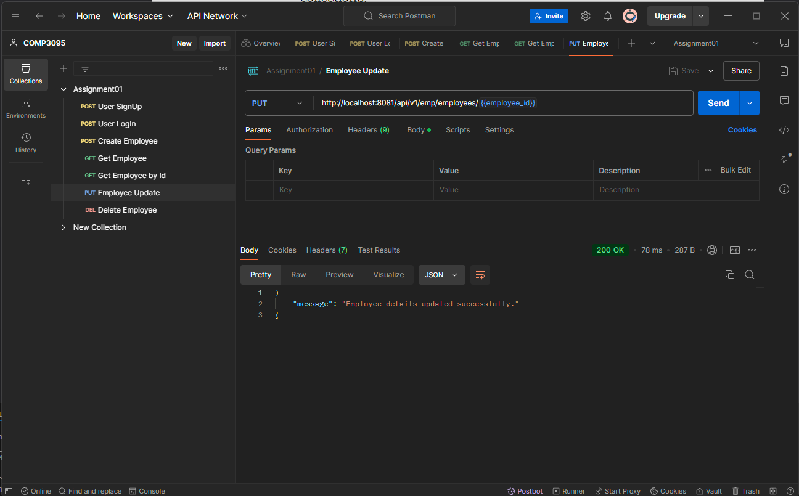
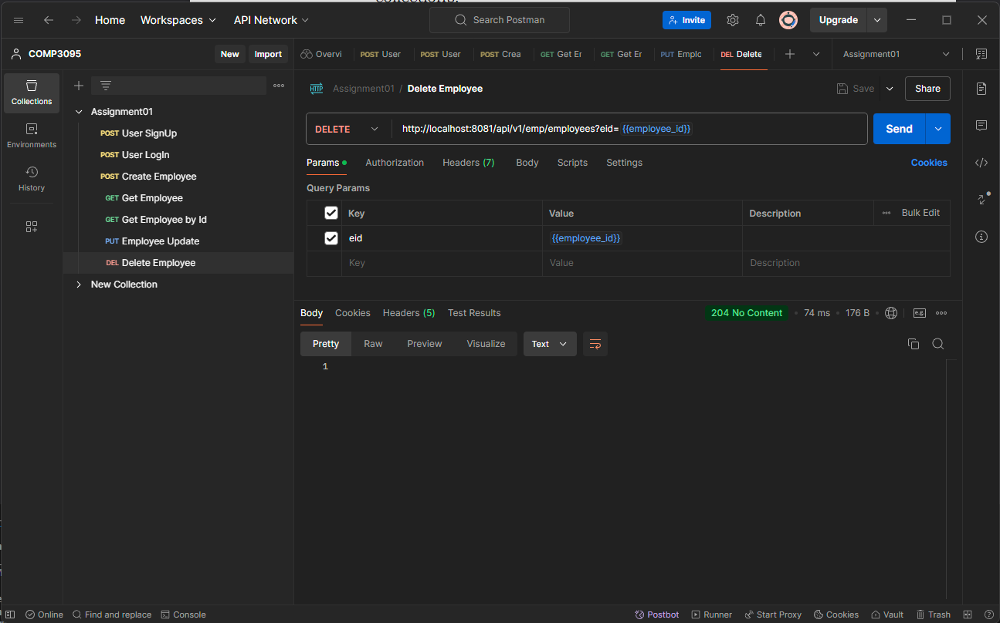

# 101411302 Conor Le

1. MongoDB Console Screenshots:

2. User Sign Up

3. User Log In

4. Create Employee

5. Get Employees

6. Get Employee by Id

7. Update Employee

8. Delete Employee

9. User Detail: 
{
    "email":    "johndoe@example.com", 
    "password": "password123" 
}

10. Hosting: https://comp-3123-thanhvu2004-conor-les-projects.vercel.app/