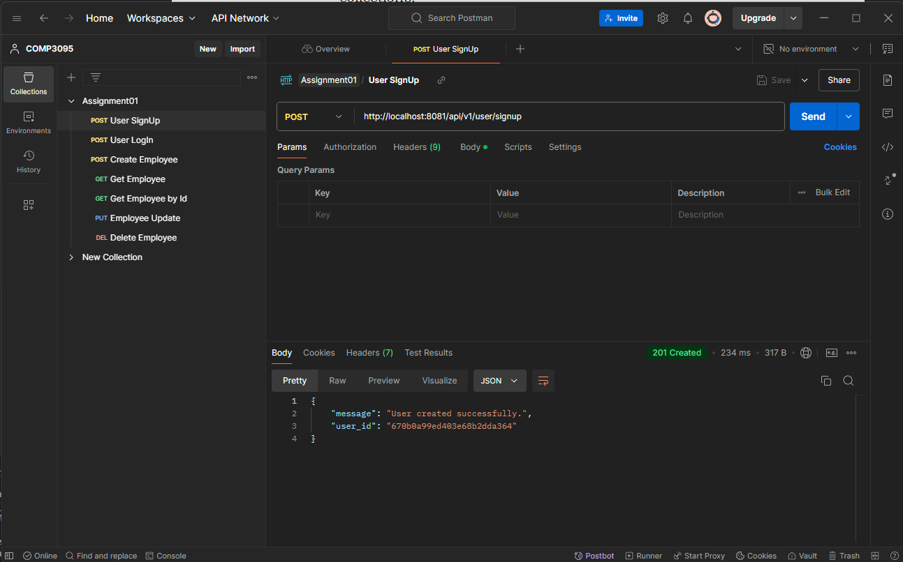
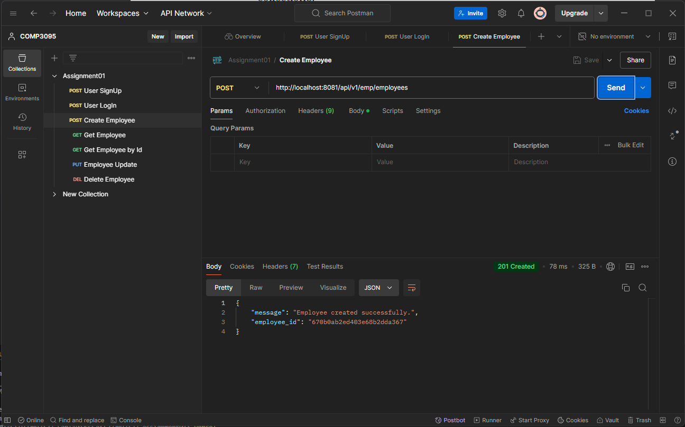
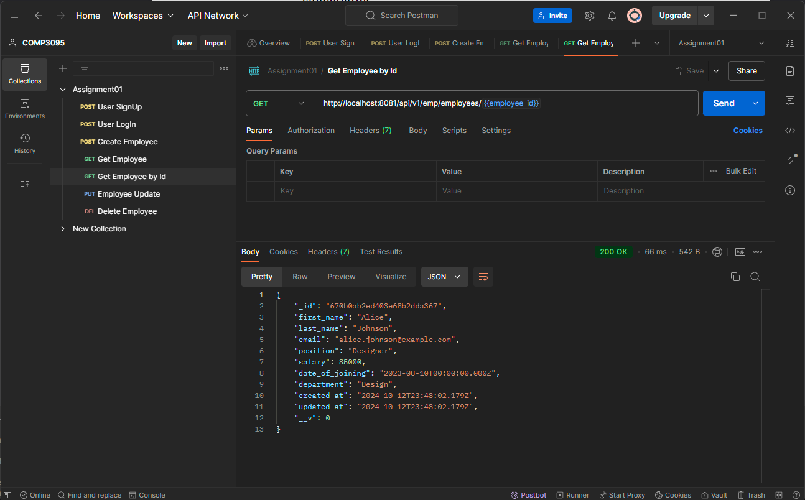
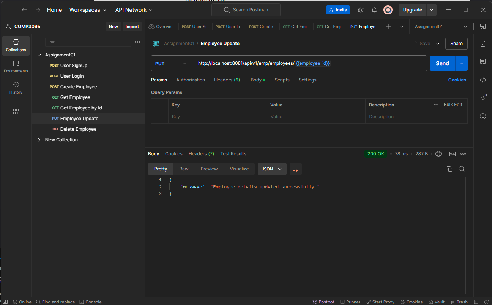
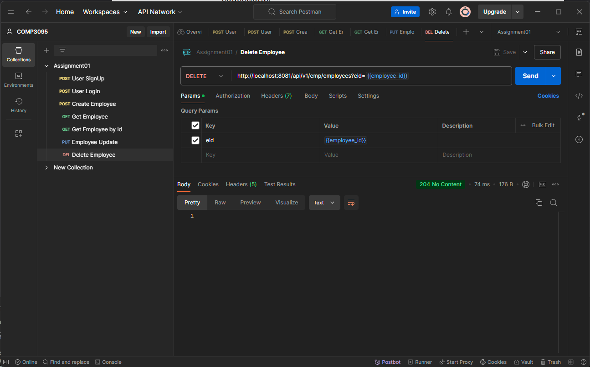

# 101411302 Conor Le

    1. MongoDB Console Screenshots:

    2. User Sign Up

    3. User Log In

    4. Create Employee

    5. Get Employees

    6. Get Employee by Id

    7. Update Employee

    8. Delete Employee
    note: The Delete doesn't return any message due to status code 204 (No Content) explicitly indicates that the response has no body, returning JSON content is not compatible with this status.

    9. User Detail: 
{
    "email":    "johndoe@example.com", 
    "password": "password123" 
}

    10. Hosting: https://comp-3123-thanhvu2004-conor-les-projects.vercel.app/*-+
